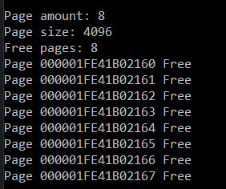
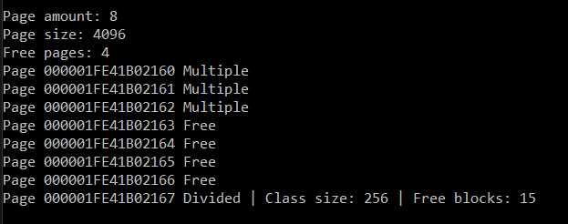
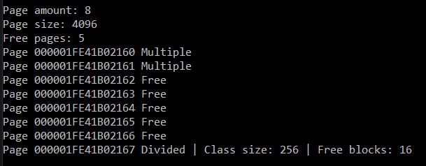
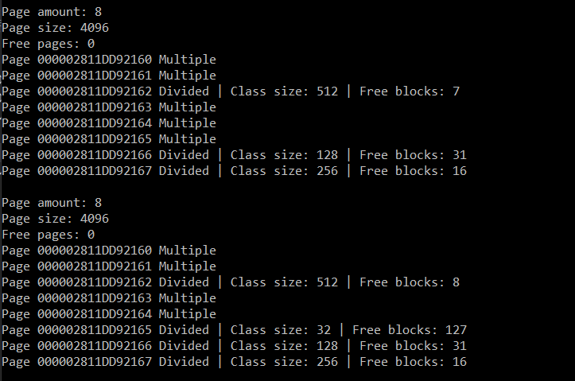

# Lab 2 - Page Allocator

## info

Memory allocator requests a certain area memory of the operating system. Further, all this memory is divided into pages.One virtual can contain several pages of the allocator. All pages are aligned, so when accessing data at any address within a page, we refer to only one virtual page. The size of a page in this implementation is 4kb.
All memory blocks are divided into two groups. The first group includes blocks with sizes less than or equal to half the page, the second all the rest. The blocks of the first group are divided into classes.
If an application requests a block of memory of some size less than or equal to half a page, then the allocator assigns the closest class to this block. The blocks of the second group are blocks of one or more pages. If an application requests a block of memory of some size greater than half a page, then the allocator rounds this size to the nearest integer number of pages.
Pages can be in several states:
- **Free** - page is not occupied
- **Divided** - page is divided into blocks of the same size
- **MultiplePage** - page is used to allocate a block of memory bigger than half of the page (2 kb)

Each page has a header to keep track of the state of the page. The header consists of:
- **state** - state of the page
- **size** - the class size of Divided page or size of multiple pages for **MultiplePage**
- **HelperAddr** - pointer to the next free block for Divided page
- **blocks** - number of free blocks for Divided page or number of pages used for multipage allocation for MultiplePage


### Algorithm description

#### Allocate function
```
#Description of the PROTOTYPE algorithm: void * mem_alloc (size_t size)
```

The function allocates a block of memory of the specified size in size bytes. If the memory block was allocated successfully, it returns the address of the beginning of this block, otherwise it returns NULL.
### Reallocate function
```
#Description of the PROTOTYPE algorithm: void * mem_realloc (void * addr, size_t size)
```

The function changes the size of the memory block with address addr to size bytes. In this case, the contents (all or part) of the old memory block are transferred to another memory block.

### Free memory function
```
#Description of the PROTOTYPE algorithm: void mem_free (void * addr)
```

The function frees the previously allocated block of memory.
## DEMONSTRATION

### We create an 8-page distributor

##### Code
```PageAllocator allocator = PageAllocator(32 * 1024);
    allocator.mem_dump();
```
##### Output



### Test mem_alloc
#### Create a request for 200 bytes, 8 and 4 kb
##### Code
```
    auto* loc1 = allocator.mem_alloc(200);  
    auto* loc2 = allocator.mem_alloc(8 * 1024);
    auto* loc3 = allocator.mem_alloc(4 * 1024);
    allocator.mem_dump();
```

##### Output


### Test mem_free
#### We clear 200 bytes and 4kb
##### Code
```
    allocator.mem_free(loc1);
    allocator.mem_free(loc3);
    allocator.mem_dump();
```

##### Output


---

### test mem_realloc
#### We replace 5 kb with 32 bytes and 400 by 4 kb
##### Code
```
    auto* loc4 = allocator.mem_alloc(400);
    auto* loc5 = allocator.mem_alloc(4 * 1024);   
    auto* loc6 = allocator.mem_alloc(100);
    auto* loc7 = allocator.mem_alloc(5 * 1024);
    allocator.mem_dump();
    loc7 = allocator.mem_realloc(loc7, 32);
    loc4 = allocator.mem_realloc(loc4, 4 * 1024);    
    allocator.mem_dump();
```

##### Output

---

###It just work =D###
